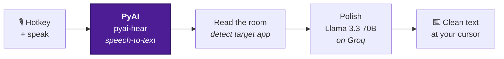
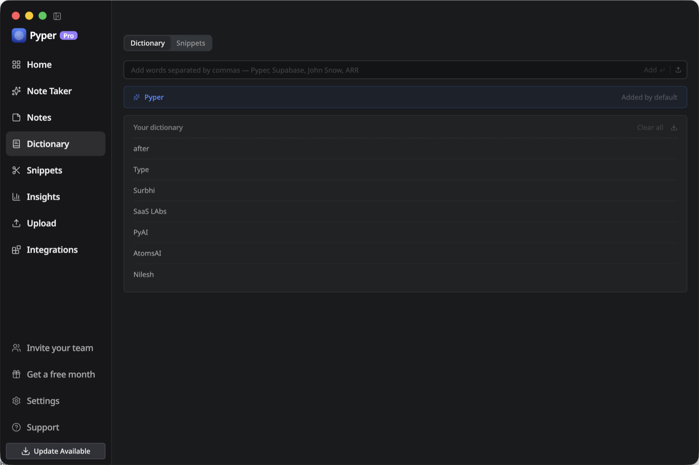
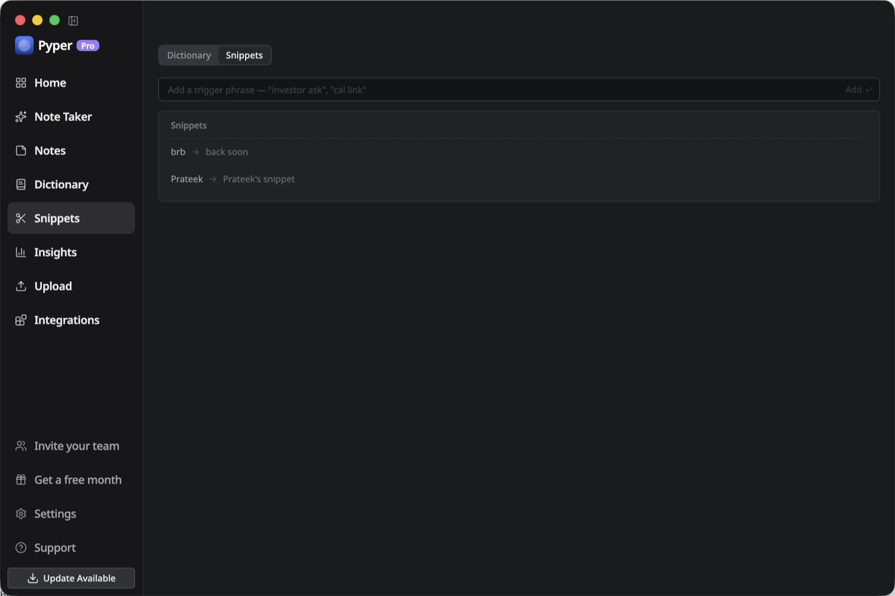
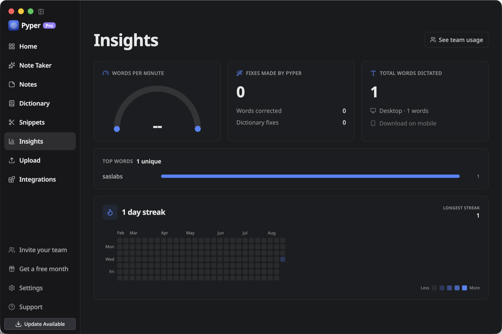
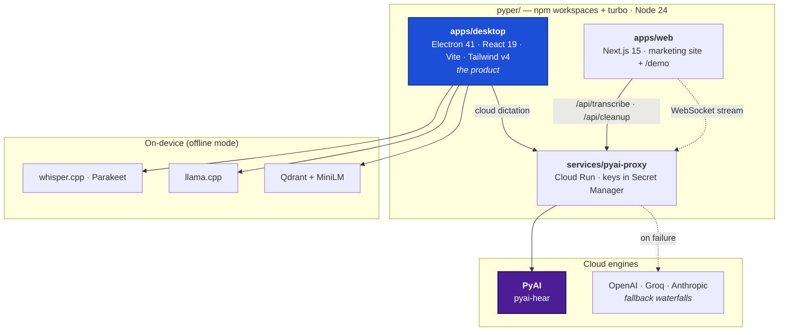

<p align="center">
  <a href="https://www.pyper.work"></a>
</p>

<h1 align="center">Pyper</h1>

<p align="center">
  <b>Privacy-first, open-source voice-to-text.</b><br/>
  Press a key, speak, and finished writing lands at your cursor — in any app.<br/>
  Speech-to-text powered by <a href="https://pyai.com"><b>PyAI</b></a>.
</p>

<p align="center">
  <a href="https://www.pyper.work/install"></a>
  <a href="https://pyai.com"></a>
  
  
  
  <a href="LICENSE"></a>
</p>

<p align="center">
  <a href="https://www.pyper.work"><b>Website</b></a> &middot;
  <a href="https://www.pyper.work/demo"><b>Live demo</b></a> &middot;
  <a href="https://www.pyper.work/install"><b>Download</b></a> &middot;
  <a href="https://pyai.com"><b>PyAI</b></a> &middot;
  <a href="docs/architecture.md"><b>Architecture</b></a>
</p>

<div align="center">
  <figure>
    
    <figcaption>
      <p align="center"><i>Dictate anywhere with a global hotkey — every dictation is transcribed, polished, and pasted at your cursor.</i></p>
    </figcaption>
  </figure>
</div>

---

## Get Pyper

**No setup. No API keys. No build step.** Download it, launch it, press the hotkey, and talk.

<p align="center">
  <a href="https://www.pyper.work/install"></a>
  &nbsp;
  <a href="https://www.pyper.work/demo"></a>
</p>

<p align="center">
  <a href="https://www.pyper.work"><b>www.pyper.work</b></a> — download, launch, press the hotkey. The
  browser demo at <a href="https://www.pyper.work/demo"><b>/demo</b></a> runs the same pipeline with nothing to install at all.
</p>

| Platform | Status | Direct download |
|---|---|---|
| **macOS** · Apple Silicon | Available — v1.9.3 | [`Pyper-latest-arm64.dmg`](https://storage.googleapis.com/pyper-desktop-downloads/Pyper-latest-arm64.dmg) |
| **macOS** · Intel | Available — v1.9.3 | [`Pyper-latest-x64.dmg`](https://storage.googleapis.com/pyper-desktop-downloads/Pyper-latest-x64.dmg) |
| **Windows** | Coming soon | [Build from source](#build-from-source) — `npm run build:win -w @pyper/desktop` |
| **Linux** | Coming soon | [Build from source](#build-from-source) — `npm run build:linux -w @pyper/desktop` |

Those direct links are stable "latest" paths that every release overwrites, so they always serve the newest build — and once installed, Pyper updates itself in place.

> [!NOTE]
> **First launch on macOS.** Pyper isn't notarized by Apple yet, so macOS blocks the first open.
> Right-click Pyper in Applications → **Open** → **Open**. Full walkthrough at
> [pyper.work/install](https://www.pyper.work/install).

---

## What Pyper is

Pyper is an open-source alternative to Wispr Flow. A global hotkey records your voice, **[PyAI](https://pyai.com)** turns it into text, a fast LLM rewrites that text into finished prose, and the result is pasted straight into whatever app you were already typing in.

- **Built on [PyAI](https://pyai.com).** PyAI's `pyai-hear` model is Pyper's speech-to-text engine — the default and the primary one, and what you're using unless you deliberately change it.
- **It writes, it doesn't transcribe.** A cleanup pass strips fillers, fixes punctuation, and reflows speech into writing — tuned to the app you're dictating into.
- **You own the privacy trade-off.** Run on Pyper's cloud engines with zero configuration, bring your own API key, or run the whole pipeline offline so no audio ever leaves the device.

---

## How it works

Every dictation runs the same three stages — **capture → transcribe → polish** — and drops the finished text wherever your cursor is. Nothing appears until you stop speaking, so the polish step always sees the whole utterance.



1. **Capture** — a global hotkey records your voice (push-to-talk or toggle). macOS defaults to the Globe/Fn key; Windows and Linux to `Control + Super`.
2. **Transcribe** — audio becomes a raw transcript. In cloud mode this is delivered by **[PyAI](https://pyai.com)** (`pyai-hear`), Pyper's speech engine, with Whisper-family engines standing behind it as automatic fallback (see [Engines](#engines)).
3. **Polish** — the raw transcript is rewritten into clean prose: fillers removed, grammar and punctuation fixed, lists and messages formatted. Runs on **Groq's Llama 3.3 70B** by default, picked as the lowest-latency link (~300 ms on Groq's LPU) in an automatic provider waterfall.

### Reads the room

Pyper detects the app you're dictating into at the moment you speak and adapts the polish to match — so the same words come out in the right register for where they're headed:

| Target | Polish style |
|---|---|
| **Notes** (Apple Notes, Notion, Obsidian, Bear) | Terse fragments and bullet points, filler dropped |
| **Chat** (Slack, Teams, Discord, iMessage, WhatsApp) | Casual and conversational, no greeting or sign-off |
| **Email** (Gmail, Outlook, Spark) | Formal, with a greeting and sign-off added |
| **Docs** (Google Docs, Word) | Clean document prose, headings and lists where natural |
| **Code** (VS Code, terminals) | Terse and imperative, identifiers preserved verbatim |

Native apps are matched by bundle id; web apps (Gmail, Slack web, Notion…) by the browser's active-tab URL. The routing rules live in [`services/pyai-proxy/channelStyles.js`](services/pyai-proxy/channelStyles.js) and are pinned by the dataset in [`services/pyai-proxy/eval/`](services/pyai-proxy/eval).

---

## Engines

### Cloud (the default — nothing to configure)

Out of the box Pyper runs on its cloud engines: no keys to enter, no models to download. Both stages sit behind a CORS- and key-gated **Cloud Run proxy** ([`services/pyai-proxy`](services/pyai-proxy)) that holds every credential in GCP Secret Manager, so **no API key ever reaches the client** — not the desktop app, not the browser, not the web host.

| Stage | Primary engine | Automatic fallback |
|---|---|---|
| **Transcription** | **[PyAI](https://pyai.com) · `pyai-hear`** | OpenAI `gpt-4o-transcribe` → Groq `whisper-large-v3` |
| **Polishing** | **Groq · `llama-3.3-70b-versatile`** (~300 ms) | OpenAI `gpt-4o-mini` → Anthropic `claude-haiku-4-5` |

Both chains are ordered **waterfalls**: if the primary engine is rate-limited or unreachable, the same request transparently falls through to the next link, and the order is configurable by environment variable with no code change — so a single provider outage never drops your words.

**On languages, honestly:** `pyai-hear` is a Hindi/English multilingual model and takes every request first. The Whisper-family engines behind it widen language coverage and double as a language-detection second opinion: on a short, ambiguous utterance where `pyai-hear` may lean Hindi for words actually spoken in English, Pyper checks with a Whisper engine and keeps the better transcript. Longer transcripts are never second-guessed.

### Local (fully offline)

Every stage can also run entirely on your machine, so no audio ever leaves the device:

| Stage | Local engine |
|---|---|
| **Transcription** | **whisper.cpp** (GGML `tiny` → `large`, plus `turbo`; CUDA / Vulkan / Metal accelerated) or **NVIDIA Parakeet** via sherpa-onnx, including cache-aware streaming models |
| **Polishing / agent** | **llama.cpp** server running a local GGUF model (Qwen, Llama, Mistral, GPT-OSS) |
| **Notes search** | **Qdrant** vector DB + `all-MiniLM-L6-v2` embeddings, on-device |
| **Speaker diarization** | On-device speaker embeddings via ONNX Runtime |

Or bring your own cloud key (OpenAI, Anthropic, Gemini, Groq…) and manage the providers yourself.

---

## Features

- **Dictate into anything** — one global hotkey, automatic paste, tone matched to the target app
- **60+ languages**, plus a translation hotkey: dictate in one language, paste in another
- **Talk to an AI agent** — say "Hey \<name\>" mid-dictation and the rest runs as a command instead of landing as text
- **Meetings, handled** — automatic detection, system-audio capture, speaker diarization, and calendar sync
- **Notes with semantic search** — on-device embeddings, so search finds meaning rather than keywords
- **Offline when you want it** — every stage has a local engine; no audio need ever leave the machine

<details>
<summary><b>See the full feature list</b> — dictation, the AI agent, meetings, notes, and platform integration</summary>

<br/>

**Dictation**

- Global hotkey dictation into any app, with automatic pasting (push-to-talk or toggle)
- Channel-aware cleanup that adapts tone to the target app (see [Reads the room](#reads-the-room))
- 60+ dictation languages, with a dedicated translation hotkey — dictate in one language, paste in another
- Custom dictionary for names, jargon, and product terms the model keeps getting wrong
- Live transcription preview while you speak (streaming Parakeet and cloud streaming engines)
- Waveform overlay with cancel/stop, positioned wherever you want it on screen

**AI agent**

- Named voice agent — say "Hey \<name\>" mid-dictation and the rest is treated as a command, not text
- Dedicated voice-agent hotkey that skips the wake word and the cleanup pass entirely
- Edit highlighted text in place, or send a screenshot of your screen as context
- Providers: OpenAI, Anthropic, Gemini, Groq, a LAN endpoint, or a fully local llama.cpp model

**Meetings**

- Automatic meeting detection from process, microphone, and calendar signals (event-driven, not polling)
- System-audio capture with live speaker diarization and voice fingerprints that persist across meetings
- Google Calendar, Microsoft Graph, and Apple Calendar (EventKit) sync, with meeting reminders
- Audio and video import: drag in files, batch-upload, or paste a YouTube/audio URL

**Notes**

- Notes with folders, full-text search, and AI actions
- Local semantic search — Qdrant + `all-MiniLM-L6-v2`, hybrid FTS5 + vector retrieval fused with Reciprocal Rank Fusion

**Platform integration**

- macOS: Globe/Fn key capture, AppleScript paste, Dock/tray behavior, launch at login
- Windows: low-level keyboard hook for true push-to-talk, WASAPI mic + system-audio capture, NSIS installer
- Linux: XTest paste with xdotool/wtype/ydotool fallbacks, and native global shortcuts on GNOME, KDE, and Hyprland under Wayland
- Secrets encrypted at rest with Electron `safeStorage`; transcription history kept in an on-device SQLite database

</details>

---

## Inside the app

<table>
  <tr>
    <td width="50%"></td>
    <td width="50%"></td>
  </tr>
  <tr>
    <td><b>It learns your words.</b> Add the names and jargon it keeps getting wrong; every dictation after that spells them right.</td>
    <td><b>It stops you retyping.</b> Say a short trigger, and the whole block lands — intros, sign-offs, links you type all day.</td>
  </tr>
  <tr>
    <td colspan="2"></td>
  </tr>
  <tr>
    <td colspan="2"><b>And it keeps score.</b> Words dictated, speaking pace and the streak you are on — computed from your own history, on your machine.</td>
  </tr>
</table>

## Architecture

Three deliverables in one repo: the **desktop app** (the product), the **marketing site + live demo**, and a small **cloud proxy** that fronts the dictation engines.



| Package | Path | Stack | What it does |
|---|---|---|---|
| **Desktop** | [`apps/desktop`](apps/desktop) | Electron 41, React 19, Vite, Tailwind v4, TypeScript | The dictation app. Main process owns hotkeys, IPC, storage, and every inference sidecar; the renderer is one React app across four windows. See its [README](apps/desktop/README.md) and [technical reference](apps/desktop/CLAUDE.md). |
| **Web** | [`apps/web`](apps/web) | Next.js 15 (App Router), React 19 | Marketing site plus the zero-install [`/demo`](apps/web/app/demo) that runs the real pipeline in the browser. |
| **PyAI proxy** | [`services/pyai-proxy`](services/pyai-proxy) | Node 20+, Cloud Run | Fronts the cloud engines: PyAI transcription waterfall + channel-aware cleanup waterfall. Every key stays server-side. |

Deeper maps live in [`docs/architecture.md`](docs/architecture.md) — full process model, the end-to-end dictation pipeline, and the native OS glue per platform.

---

## Build from source

For contributors, and for anyone who wants to audit or self-host the pipeline. **You do not need any of this to use Pyper** — see [Get Pyper](#get-pyper).

### Prerequisites

- **Node 24** (pinned in [`.nvmrc`](.nvmrc)) — a different major version rewrites `package-lock.json` incompatibly
- macOS, Windows, or Linux; Xcode Command Line Tools on macOS for the Swift helper binaries

### Quickstart

```bash
git clone https://github.com/prateekjain98/pyper.git
cd pyper

nvm use 24         # must be Node 24 — or prefix installs with: nvm exec 24
npm install        # .npmrc already sets legacy-peer-deps, so no flags needed

npm run desktop    # run the Electron app
npm run web        # run the marketing site + live demo → http://localhost:3000
```

Both `desktop` and `web` are long-running dev servers — run them in separate terminals.

The first `npm run desktop` also compiles the native helper binaries and downloads local model assets (sherpa-onnx, Qdrant, the VAD and embedding models, yt-dlp), so expect it to take a while. Subsequent runs are fast.

<details>
<summary><b>All workspace commands</b></summary>

<br/>

Run from the repo root:

| Command | What it does |
|---|---|
| `npm run desktop` | Dev-run the Electron app (renderer + main, concurrently) |
| `npm run web` | Dev-run the Next.js site at `http://localhost:3000` |
| `npm run typecheck` | `tsc --noEmit` across desktop and web |
| `npm run lint` | ESLint across desktop and web |
| `npm run build` | Full build of every workspace — **includes electron-builder packaging and model downloads.** Slow; not a per-change check |
| `npm run format` | Prettier across workspaces |

Scoped to the desktop app (`-w @pyper/desktop`):

| Command | What it does |
|---|---|
| `npm test -w @pyper/desktop` | Unit tests — 237 suites, run with `node --test` |
| `npm run build:renderer -w @pyper/desktop` | Fast Vite renderer build (the useful per-change UI check) |
| `npm run compile:native -w @pyper/desktop` | Compile the Swift/C helper binaries for this platform |
| `npm run pack -w @pyper/desktop` | Unsigned local package (`CSC_IDENTITY_AUTO_DISCOVERY=false`) |
| `npm run build:mac -w @pyper/desktop` | Signed macOS build (`build:mac:arm64` / `build:mac:x64` for one arch) |
| `npm run build:win -w @pyper/desktop` | Windows NSIS installer |
| `npm run build:linux -w @pyper/desktop` | Linux bundles (`:appimage`, `:deb`, `:rpm`, `:tar` for one format) |

The proxy runs standalone with `node server.js` from [`services/pyai-proxy`](services/pyai-proxy) — Node 20+ built-ins plus `ws`, nothing else. It needs `PYAI_API_KEY` (and optionally `OPENAI_API_KEY`, `GROQ_API_KEY`, `ANTHROPIC_API_KEY` for the fallback links); `GET /health` reports which engines resolved.

</details>

<details>
<summary><b>Repository layout</b></summary>

<br/>

```
pyper/
├── apps/
│   ├── desktop/          # Electron desktop app — the product
│   │   ├── src/          # React renderer + main-process helpers
│   │   ├── resources/    # Swift/C native sources + bundled binaries
│   │   ├── scripts/      # native compile + model download scripts
│   │   └── test/         # node --test unit suites
│   └── web/              # Next.js marketing site + /demo
├── services/
│   └── pyai-proxy/       # Cloud Run proxy: /transcribe (PyAI) + /cleanup
├── docs/                 # architecture and pipeline deep-dives
├── package.json          # workspace root (npm workspaces)
└── turbo.json            # task pipeline
```

</details>

<details>
<summary><b>Troubleshooting</b></summary>

<br/>

**macOS blocks the first launch** — Pyper isn't notarized yet. Right-click Pyper in Applications → **Open** → **Open**, or allow it under System Settings → Privacy & Security. If macOS says the app is *damaged*, it was quarantined on download; clear it with:

```bash
xattr -dr com.apple.quarantine /Applications/Pyper.app
```

**Nothing pastes after dictation** — grant Accessibility permission (macOS: System Settings → Privacy & Security → Accessibility). On Linux, the native XTest paste helper is tried first, then `xdotool` (X11/XWayland), `wtype` (wlroots), and `ydotool` (needs `ydotoold` running).

**The hotkey does nothing on macOS** — Globe/Fn capture needs the compiled Swift listener binary *and* Accessibility permission. Run `npm run compile:native -w @pyper/desktop`, then re-grant Accessibility. Pyper falls back to F8/F9 when the configured hotkey can't be registered.

**Local transcription fails** — confirm the whisper.cpp or sherpa-onnx binary exists under `apps/desktop/resources/bin/` and that the model finished downloading into `~/.cache/pyper/`. Re-run `npm run download:whisper-cpp -w @pyper/desktop` or `npm run download:sherpa-onnx -w @pyper/desktop`.

**Semantic notes search returns nothing** — Qdrant may not have started. Check that `resources/bin/qdrant-{platform}-{arch}` exists and that the embedding model landed in `~/.cache/pyper/embedding-models/`. Search still works via FTS5 keyword fallback when Qdrant is down.

**Meeting detection stuck in polling mode** — the event-driven path needs its per-platform helper: `macos-mic-listener` (macOS), `windows-mic-listener.exe` (Windows), or `pactl` from `pulseaudio-utils` / `pipewire-pulse` (Linux). Detection degrades to polling automatically when they're missing.

**`npm ci` breaks after your install** — you installed on the wrong Node major. Re-run with `nvm exec 24 npm install` and commit the regenerated lockfile.

More platform-specific notes are in [`apps/desktop/CLAUDE.md`](apps/desktop/CLAUDE.md).

</details>

---

## Contributing

Contributions are welcome. Branch from `main`, keep changes scoped, and make sure `npm run typecheck` and `npm run lint` pass — plus `npm test -w @pyper/desktop` and `npm run build:renderer -w @pyper/desktop` for desktop changes — before opening a pull request. Working conventions are documented in [`CLAUDE.md`](CLAUDE.md), and the open work queue lives in [`tasks/`](tasks/README.md).

## Acknowledgements

Pyper is forked from [OpenWhispr](https://github.com/OpenWhispr/openwhispr) (MIT) and stands on whisper.cpp, llama.cpp, sherpa-onnx, NVIDIA Parakeet, Qdrant, and Electron. Speech-to-text is powered by [**PyAI**](https://pyai.com).

## License

[MIT](LICENSE) © SaaS Labs

<p align="center">
  <br/>
  <a href="https://www.pyper.work"><b>www.pyper.work</b></a> &middot;
  <a href="https://www.pyper.work/demo"><b>Try the live demo</b></a> &middot;
  <a href="https://pyai.com"><b>Built on PyAI</b></a>
</p>
