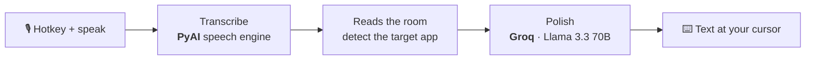

# Pyper

**Privacy-first, open-source voice-to-text — dictate polished writing into any app with a single hotkey.**

Press a key, speak, and finished text lands at your cursor — in your editor, your email, your Slack thread. Pyper is an open-source alternative to Wispr Flow: speech is transcribed and then cleaned into written prose, and you choose whether that runs on Pyper's cloud engines or fully offline on your own machine. macOS · Windows · Linux.


---

## How it works

Every dictation runs the same three stages — **capture → transcribe → polish** — and drops the finished text wherever your cursor is. Nothing appears until you stop speaking, so the polish step always sees the whole utterance.



1. **Capture** — a global hotkey records your voice (push-to-talk or toggle).
2. **Transcribe** — audio becomes a raw transcript. In cloud mode this is delivered by **PyAI**, Pyper's own speech-to-text engine (the `pyai-hear` model); Whisper engines stand behind it as automatic fallback so an outage never stops dictation.
3. **Polish** — the raw transcript is rewritten into clean prose — fillers removed, grammar and punctuation fixed, lists and messages formatted. This runs on a fast LLM, **Groq's Llama 3.3 70B** by default, chosen as the lowest-latency link (~300 ms on Groq's LPU) in an automatic provider waterfall.

### Reads the room

Pyper detects the app you're dictating into at the moment you speak and adapts the polish to match — so the same words come out in the right register for where they're headed:

| Target | Polish style |
|---|---|
| **Notes** (Apple Notes, Notion, Obsidian) | Terse fragments and bullet points |
| **Slack / chat** (Slack, Teams, Discord) | Casual and conversational, no greeting or sign-off |
| **Email** (Gmail, Outlook, Spark) | Formal, with a greeting and sign-off added |
| **Docs** (Google Docs, Word) | Clean document prose |
| **Code** (VS Code, terminals) | Terse, imperative, identifiers preserved |

Native apps are matched by bundle id; web apps (Gmail, Slack web, Notion…) by the browser's active-tab URL. See [`services/pyai-proxy/eval/`](services/pyai-proxy/eval) for the dataset that pins this behavior, and try it live on the [`/demo`](apps/web/app/demo) page.

---

## The cloud pipeline (default)

Out of the box Pyper runs on its cloud engines — no keys to configure, nothing to install. The whole pipeline sits behind a CORS- and key-gated Cloud Run proxy that holds every credential in secret storage, so no key ever reaches the browser or the web host:

| Stage | Engine | Fallback |
|---|---|---|
| **Transcription** | **PyAI** (`pyai-hear`) | OpenAI → Groq Whisper |
| **Polishing** | **Groq · Llama 3.3 70B** (~300 ms on Groq's LPU) | OpenAI → Anthropic |

Both chains are ordered **waterfalls**: if the primary engine is rate-limited or down, the request transparently falls through to the next, and the order is fully configurable by env — so a single provider outage never drops your words.

### Prefer fully offline?

Every stage can also run entirely on your machine — **Whisper.cpp** or **NVIDIA Parakeet** for transcription and a **local LLM via llama.cpp** for polishing — so no audio ever leaves the device. Or bring your own cloud key (OpenAI, Anthropic, Groq…) to self-manage the providers.

---

## Monorepo layout

This repository is a [Turborepo](https://turbo.build/repo) managed with npm workspaces.

```
pyper/
├── apps/
│   ├── desktop/          # Electron desktop app — the product (React 19 + Vite + Tailwind v4 + TypeScript)
│   └── web/              # Marketing site + live demo (Next.js, App Router)
├── services/
│   └── pyai-proxy/       # Cloud Run proxy: /transcribe (PyAI) + /cleanup (Groq waterfall)
├── package.json          # workspace root
└── turbo.json            # task pipeline
```

## Getting started

Requires **Node ≥ 24** (pinned in `.nvmrc`).

```bash
npm install
```

### Run an app

```bash
# Desktop app (Electron) — first run downloads native ASR binaries + local models
npm run desktop        # or: npx turbo run dev --filter=@pyper/desktop

# Marketing site + live demo (Next.js) — http://localhost:3000
npm run web            # or: npx turbo run dev --filter=@pyper/web
```

### Common tasks (run across all apps via Turborepo)

```bash
npm run build          # build every app
npm run lint           # lint every app
npm run typecheck      # typecheck every app
```

## Apps & services

| Package | Path | Stack | Notes |
|---|---|---|---|
| Desktop | [`apps/desktop`](apps/desktop) | Electron 41, React 19, Vite, Tailwind v4 | The dictation app. See its [README](apps/desktop/README.md) / [CLAUDE.md](apps/desktop/CLAUDE.md) for build & packaging. |
| Web | [`apps/web`](apps/web) | Next.js (App Router) | Marketing site and the live dictation [demo](apps/web/app/demo). |
| PyAI proxy | [`services/pyai-proxy`](services/pyai-proxy) | Node (Cloud Run) | Fronts the cloud engines: PyAI transcription + channel-aware Groq cleanup. |

## License

[MIT](LICENSE).
