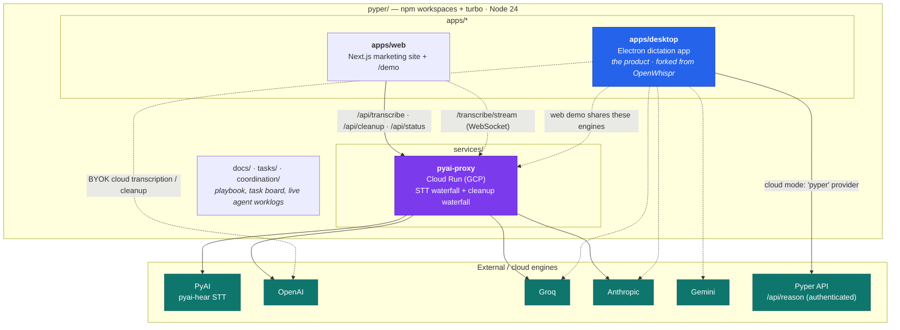
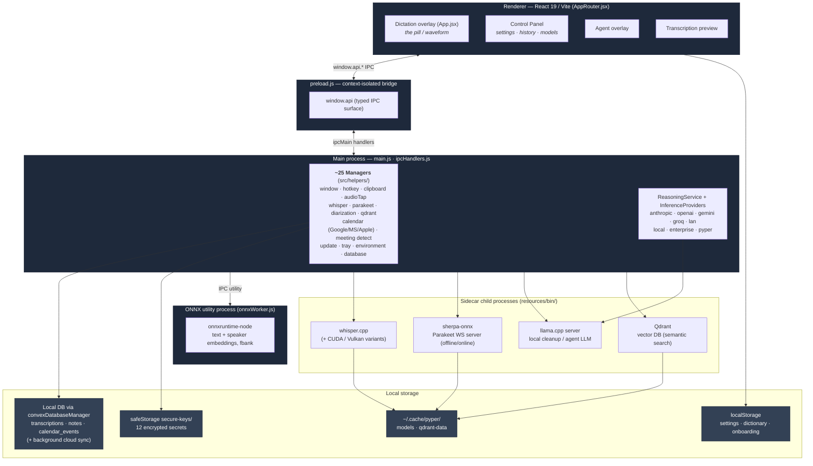
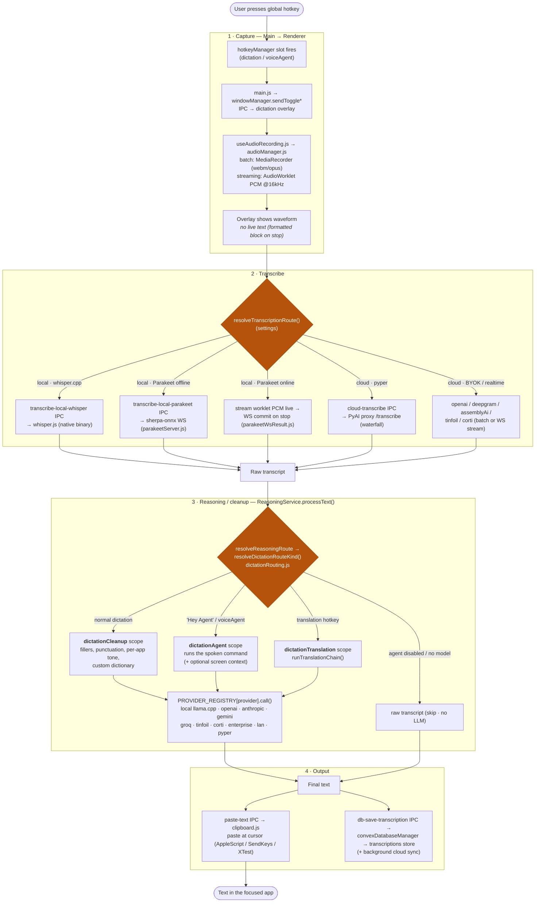
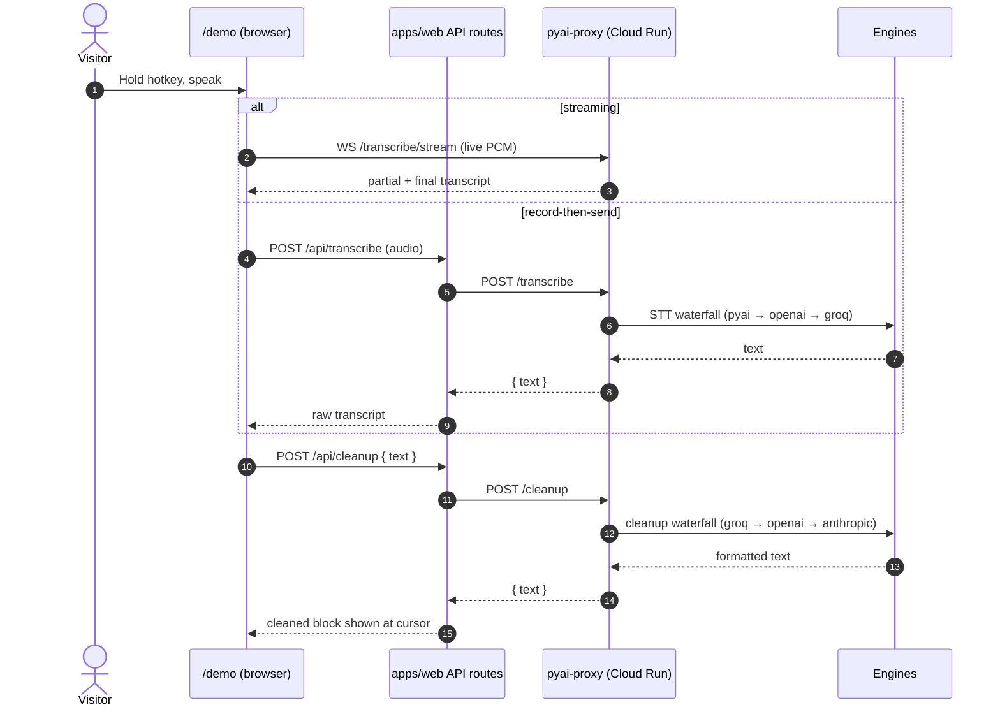

# Pyper — Architecture & Dictation Pipeline

> **Purpose:** one map of the whole monorepo, the Electron desktop app's process model, and — the
> centerpiece — the **end-to-end dictation pipeline** (hotkey → audio → transcription → cleanup →
> paste). Companion to the deep-dives in [apps/desktop/CLAUDE.md](../apps/desktop/CLAUDE.md),
> [wispr-flow-pipeline.md](wispr-flow-pipeline.md), and
> [realtime-dictation-architecture.md](realtime-dictation-architecture.md).
> **Audience:** any agent/engineer who needs the shape of the system before touching it.

All diagrams are Mermaid and render inline on GitHub.

---

## 1. Monorepo topology

Three deliverables in one repo: the **desktop app** (the product), the **marketing site + live
demo**, and a small **cloud proxy** that fronts the dictation engines. npm workspaces + turbo, pinned
to Node 24.

**Key facts**

- **apps/desktop** — Electron 41 + React 19 + Vite. Privacy-first: the **local** path (whisper.cpp /
  NVIDIA Parakeet + llama.cpp) is the default; cloud is opt-in.
- **apps/web** — Next.js. Server routes (`/api/transcribe`, `/api/cleanup`, `/api/status`) proxy to
  `pyai-proxy` so the browser needs no keys/CORS; `/demo` can also open a **WebSocket** straight to the
  proxy's `/transcribe/stream` relay for live streaming.
- **services/pyai-proxy** — dependency-free Node service on Cloud Run. Both dictation stages are
  **waterfalls** (ordered by latency, fall through on failure): STT = `pyai → openai → groq`;
  cleanup = `groq → openai → anthropic`. Keys mounted from GCP Secret Manager.

---

## 2. Desktop process model

Electron with context isolation. One **main process** owns native OS integration, IPC, storage, and
child processes; the **renderer** is a single React app rendered into four windows; a **preload**
bridge and an **ONNX utility process** round it out. All heavy inference runs in **sidecar child
processes**, so a native crash never takes down the app.

**Native OS glue** (per-platform, feeding the pipeline):

- **Global hotkey** — macOS Globe/Fn via a Swift `globe-listener` binary; Windows push-to-talk via a
  native low-level keyboard hook (`windows-key-listener.exe`); Wayland via D-Bus + GNOME/Hyprland/KDE
  shortcut managers; `globalShortcut` elsewhere.
- **Paste** — macOS AppleScript, Windows PowerShell SendKeys / nircmd, Linux XTest + xdotool/wtype/ydotool.
- **Meeting detection** — event-driven mic/process/calendar signals (separate subsystem; not on the
  dictation critical path).

---

## 3. The main dictation pipeline (end-to-end)

This is the product's core loop: **press hotkey → speak → release → cleaned text appears at the
cursor.** Recognition can stream *while you speak* (online Parakeet / cloud WS); the cleanup LLM pass
runs *after* the full utterance, then one clean block is pasted — the Wispr Flow shape.

**How to read it**

- **Capture** — the hotkey is caught in the main process and toggled into the dictation overlay over
  IPC. The overlay records mic audio (MediaRecorder + an AudioWorklet PCM tap) and shows a **waveform,
  not live text**.
- **Transcribe** — a settings-driven branch. Local **whisper.cpp** and **offline Parakeet** are
  record-then-transcribe; **online Parakeet** streams PCM to a persistent websocket and commits the
  flushed text on stop (recognition finishes as you release). Cloud transcription (BYOK, or the
  desktop's own `pyper` provider) runs the same STT waterfall the web demo uses.
- **Reasoning / cleanup** — `resolveReasoningRoute` → `resolveDictationRouteKind()`
  (`dictationRouting.js`) picks the route: the default **cleanup** scope (Wispr-style formatting), the
  **dictationAgent** scope when the user addresses the named agent or used the voice-agent hotkey
  (optionally with a screenshot), the **translation** scope for the translation hotkey, or a raw
  **skip** when no agent is configured. `ReasoningService.processText()` then dispatches through
  `PROVIDER_REGISTRY[provider].call()` to run it locally (llama.cpp) or in the cloud. The cloud
  **`pyper`** provider splits by mode: cleanup → PyAI proxy `/cleanup` (no auth, fail-open to the raw
  transcript); agent → authenticated `${PYPER_API_URL}/api/reason`.
- **Output** — the final text is pasted at the cursor via the platform clipboard path (`paste-text`
  IPC) and saved through `convexDatabaseManager` to the `transcriptions` store (raw + processed), which
  pushes to the cloud in the background.

**Four inference scopes** (independently configurable provider/model, `src/config/inferenceScopes.ts`):
`dictationCleanup` · `dictationAgent` · `noteFormatting` · `chatIntelligence` (plus the
`dictationTranslation` and `dictationAgentVision` overrides).

> **Note:** the persistence layer now routes through `convexDatabaseManager.js` (Convex-backed store +
> background sync), superseding the `better-sqlite3` / `database.js` description still in the older
> [apps/desktop/CLAUDE.md](../apps/desktop/CLAUDE.md).

---

## 4. Web demo & cloud proxy (the cloud dictation path)

The public `/demo` reuses the exact desktop pipeline shape, but cloud-only — same cleanup prompt, same
engine waterfalls — so it doubles as a live, keyless showcase of the product's core loop.

Both stages fall through to the next engine on failure, so one provider being rate-limited or out of
credits never breaks the demo. Engines are swappable entirely via env (`STT_PROVIDERS`,
`CLEANUP_PROVIDERS`, and per-provider `*_BASE_URL` / `*_API_KEY` / `*_MODEL`).

---

## 5. Where to go next

| You want to… | Read |
|---|---|
| Understand desktop internals (managers, IPC, sidecars, build) | [apps/desktop/CLAUDE.md](../apps/desktop/CLAUDE.md) |
| See what a Wispr-parity pipeline must do | [wispr-flow-pipeline.md](wispr-flow-pipeline.md) |
| Dig into realtime/streaming dictation design | [realtime-dictation-architecture.md](realtime-dictation-architecture.md) |
| Learn how agents coordinate in this repo | [../CLAUDE.md](../CLAUDE.md) · [agents-playbook.md](agents-playbook.md) |
</content>
</invoke>
