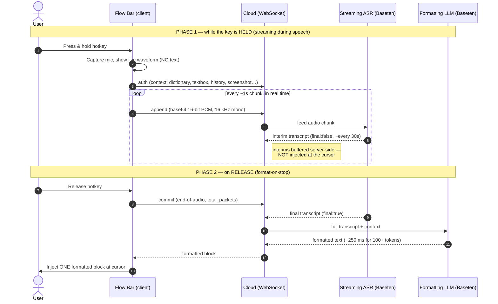

# How Wispr Flow's speech-to-text pipeline works (end-to-end)

> **Purpose:** reference doc for the Pyper team building an open-source alternative to Wispr Flow.
> Explains, end-to-end, how Flow turns held-hotkey speech into a formatted block of text at your
> cursor — and what a clone has to reproduce.
> **Audience:** Pyper engineers/agents (see root [CLAUDE.md](../CLAUDE.md) — "indistinguishable from
> Wispr Flow" is the bar).
> **Date:** 2026-08-13 · **Author:** research pass over Wispr's public API docs, its Baseten case
> study, founder/CTO talks, subprocessor disclosures, and independent reviews.

**Confidence tags** used throughout:

- **[CONFIRMED]** — stated in a first-party source (Wispr's own API docs; the Baseten case study
  co-published with Wispr; a founder/CTO on record) or corroborated across independent third parties.
- **[INFERRED]** — a reasoned conclusion from confirmed facts, not stated verbatim anywhere.
- **[UNCONFIRMED]** — plausible but unsupported; do not repeat as fact.

---

## 1. TL;DR / executive summary

- **Flow streams your microphone to the cloud *while you speak*** — audio goes up as a sequence of
  short, fixed-duration PCM chunks over a WebSocket, and a streaming ASR model transcribes
  concurrently. Recognition is therefore *finished* (or nearly so) by the moment you stop.
  **[CONFIRMED** for the public API; **INFERRED** that the desktop product uses the same streaming
  path.]
- **Nothing is shown or typed until you stop.** During dictation the UI shows only a **live
  waveform** (Flow Bar / Flow Bubble), never live word-by-word text. On release, the finished,
  *formatted* text is injected as **one block** at the cursor. **[CONFIRMED]**
- **The reason for that split is a mandatory LLM formatting pass** that needs the *whole* utterance
  (filler removal, self-corrections, punctuation, per-app tone, personal dictionary). It can only run
  after you finish, so text can only appear after you finish. **[CONFIRMED** it exists; **INFERRED**
  as the causal reason for post-stop display.]
- **Streaming ASR is the key to sub-second latency.** By moving recognition off the *post-stop*
  critical path, the only work left after release is a short final flush + a ~250 ms LLM format pass +
  network. Wispr states the **entire pipeline runs in under 700 ms (p99)**. **[CONFIRMED]**
- **It is cloud-only, on big self-hosted models.** ASR runs on **Baseten**; the formatting LLM is a
  **fine-tuned Llama** on Baseten (TensorRT-LLM + Chains), with other text routed to
  OpenAI/Anthropic/Cerebras. No offline mode. **[CONFIRMED]**

---

## 2. End-to-end pipeline

The pipeline has **two phases**: everything that happens *while the key is held* (streaming), and
everything that happens *on release* (commit → format → inject).

### 2.1 Numbered steps

1. **Hotkey press.** User presses and holds the global dictation hotkey. Flow opens its capture UI
   (desktop **Flow Bar**, mobile **Flow Bubble**). **[CONFIRMED]**
2. **Mic capture + waveform.** Flow captures the microphone and renders a **live audio waveform** with
   Cancel/Stop controls. **No transcript text is displayed.** **[CONFIRMED]**
3. **Auth + context handshake.** The client opens a WebSocket and sends an **`auth`** message. This
   message carries **personalization context**: language preferences, user metadata, **textbox /
   surrounding-app contents**, conversation history, personal-dictionary terms, and even screenshots.
   **[CONFIRMED — Wispr WebSocket API docs.]**
4. **Real-time audio streaming.** As the user speaks, the client sends **`append`** messages in real
   time, each carrying a short, **fixed-duration** chunk (≈1 s in the reference client) of
   **base64-encoded, single-channel, 16-bit (int16) PCM WAV sampled at 16 kHz**. Chunks must be of
   consistent duration. **[CONFIRMED.]**
5. **Streaming ASR (concurrent with speech).** The server feeds each chunk to a **self-hosted
   streaming ASR model on Baseten** and emits **interim** transcripts (`"final": false`). Interims are
   returned only **roughly every 30 seconds**, so a typical short dictation produces *no* user-visible
   interim before the end. These results are **buffered server-side and are NOT injected at the
   cursor.** **[CONFIRMED — API docs; buffering-not-injected is INFERRED from display behavior in §5.]**
6. **Hotkey release → commit.** User releases the key. The client sends a **`commit`** message marking
   **end-of-audio**, including the total packet count (`total_packets`). **[CONFIRMED.]**
7. **Final transcript flush.** The ASR emits a single **final** transcript (`"final": true`) for the
   whole utterance before the socket closes. This is the only ASR step left on the post-stop critical
   path, and it is short because recognition already ran during speech. **[CONFIRMED** that a final is
   emitted; **INFERRED** that it is short/cheap.]
8. **LLM formatting pass.** The full transcript **plus the context from step 3** is sent to a
   **fine-tuned Llama formatting model** (auto-punctuation/capitalization, "um/uh" filler removal,
   self-correction resolution, per-app tone/format, personal dictionary). Target budget: **100+ tokens
   in under 250 ms.** **[CONFIRMED.]**
9. **Inject one formatted block.** The finished, formatted text is inserted **as a single block** at
   the cursor in whatever app has focus. Users report hitting Enter "~0.5 s after dictation appears."
   **[CONFIRMED.]**

### 2.2 Sequence diagram (streaming-during-speech, format-on-stop)



### 2.3 The critical path (why it feels instant)

```
KEY DOWN ─────────────────── speaking ─────────────────── KEY UP
   │                                                         │
   │   mic → ~1s PCM chunks → WebSocket → streaming ASR      │   recognition happens HERE,
   │   (interims buffered; user sees only a waveform)        │   OFF the post-stop critical path
   │                                                         ▼
                                     commit → short final flush          ┐
                                     → LLM format pass (~250 ms)         │  post-stop critical path
                                     → inject ONE block at cursor        ┘  (target: sub-second)
```

The trick is that the expensive, time-proportional-to-speech-length work (ASR) overlaps with the user
talking. After release, only a bounded amount of work remains, so perceived latency is roughly
constant regardless of how long the utterance was.

---

## 3. Streaming vs. batch — how and why they stream

**How.** Flow does **not** record a whole clip and upload it after you stop. It maintains a live
WebSocket and pushes audio incrementally:

- `auth` → open connection + supply personalization context. **[CONFIRMED]**
- `append` (many) → one per short PCM chunk, sent *as the audio is produced*. **[CONFIRMED]**
- `commit` (one) → end-of-audio marker, triggering the final transcript. **[CONFIRMED]**
- Server → interim (`final:false`) and final (`final:true`) transcript messages. **[CONFIRMED]**

**Why.** Streaming moves the cost of recognition **off the post-stop critical path**. The founder's
framing is explicit: **"less than 0.5 s latency streaming vs. multi-second delays in LLM APIs."**
Recognizing a 15-second utterance in one batch call *after* release would add multiple seconds of
felt latency; streaming amortizes it into the time you were already speaking. **[CONFIRMED — founder
statement.]**

**Nuance / weak counter-evidence.** In an SE Radio interview, Wispr's CTO loosely describes "they
speak… we send it to a server," which is casual phrasing, **not** a claim that audio is batched.
Weighed against the public streaming API and the latency numbers, the streaming reading is the correct
one. **[INFERRED from the balance of evidence.]**

> **Key distinction for a clone:** *transcription* is streamed and concurrent; *display/injection* is
> batched to the end. Those are two different decisions — Flow streams recognition for latency but
> withholds output for formatting quality.

---

## 4. Latency — approach and numbers

### 4.1 Stated targets & measurements

| Figure | Value | Source type | Tag |
|---|---|---|---|
| End-to-end pipeline | **under 700 ms (p99)** — "from speech recognition models to Llama-based transcript enhancement" | Baseten case study (w/ Wispr) | **[CONFIRMED]** |
| Formatting LLM sub-step | **100+ tokens in < 250 ms** | Baseten case study | **[CONFIRMED]** |
| LLM inference SLO | **< 500 ms** for millions of requests | Wispr job posting | **[CONFIRMED]** |
| Streaming latency framing | **< 0.5 s** streaming vs. "multi-second" batch LLM APIs | Founder/investor talk | **[CONFIRMED]** |
| Real-world (review) | **~700 ms** | Independent review (willowvoice) | **[CONFIRMED]** |
| Real-world (review) | **~1,805 ms average** | Independent review (weesperneonflow) | **[CONFIRMED]** |

The spread between Wispr's ~700 ms p99 and an independent ~1.8 s average is expected: vendor numbers
are server-side pipeline latency under ideal conditions; third-party numbers include the user's
network round-trip, cold paths, and end-to-end wall-clock. **[INFERRED.]**

### 4.2 How they hit it (techniques, from the CTO's SE Radio 703 talk)

- **Speculative decoding** ("guess and verify") to cut LLM latency by **more than half**. **[CONFIRMED
  — CTO statement.]**
- **Hard latency budgets** baked into the product (e.g. "50–100 words in only 250 ms"). **[CONFIRMED.]**
- **Right-sized models** — smallest model that clears the quality bar, not the biggest. **[CONFIRMED.]**
- **Regional GPU co-location** to shrink network hops. **[CONFIRMED — CTO statement;** note the Baseten
  case study itself does not detail co-location.]**
- **Warm, self-hosted GPUs on Baseten** (no cold starts) + **Cerebras** for ultra-fast text
  generation. **[CONFIRMED.]**

> **Takeaway for Pyper:** sub-second feel is a *systems* achievement, not a single model. Streaming
> ASR + warm inference + a tiny, budgeted formatting model + network locality together buy the number.

---

## 5. Display behavior — no live text, formatted block on stop

- **While dictating:** the desktop **Flow Bar** and mobile **Flow Bubble** display a **live waveform**
  with Cancel/Stop — **not** live transcript text. **[CONFIRMED — Wispr docs.]**
- **On stop:** "You release when done and then wait briefly while Flow transcribes and inserts your
  formatted text — text does **not** appear live word-by-word … it appears **after** dictation is
  complete." **[CONFIRMED — independent review.]**
- **Mechanistically:** the API returns interim results only ~every 30 s, so short dictations return
  effectively **one final block after `commit`**; there is nothing to stream to the cursor mid-utterance
  even if the product wanted to. **[CONFIRMED — API cadence; INFERRED link to the block-on-stop UX.]**
- **Result:** users report pressing Enter ~0.5 s after the text lands — the block appears complete and
  already formatted, so there is no "watch it clean itself up" moment. **[CONFIRMED.]**

**Why not show live text?** Because the visible output is the *formatted* output, and formatting (§7)
needs the entire utterance. Showing raw interims would mean showing text that then visibly rewrites
itself — worse UX than a brief wait for a clean block. **[INFERRED.]**

---

## 6. STT model / stack

| Layer | What Wispr uses | Tag |
|---|---|---|
| **ASR inference host** | **Self-hosted on Baseten** (warm GPUs, autoscaled) | **[CONFIRMED — subprocessor disclosure + Baseten]** |
| **ASR model** | Wispr's **own fine-tuned speech model(s)** — "scaling personalization of our speech models and LLMs with fine-tuning and RL"; "custom in-house ML models optimized weekly" | **[CONFIRMED it's in-house/fine-tuned]** |
| **ASR base architecture** | Whisper-derived base is *plausible* but **not stated** | **[UNCONFIRMED — do not assert]** |
| **Formatting LLMs (text)** | **OpenAI, Anthropic, Cerebras** (routed) | **[CONFIRMED — subprocessor disclosure]** |
| **Command Mode fallback** | **Fireworks AI, OpenRouter** | **[CONFIRMED]** |
| **Storage** | **AWS, us-east-1** | **[CONFIRMED]** |
| **Offline mode** | **None** — cloud-only | **[CONFIRMED]** |

**Myth to avoid:** **Deepgram is NOT a Wispr subprocessor.** A coincidentally-named GitHub repo
spawned that rumor; do not attribute Wispr's ASR to Deepgram. **[CONFIRMED correction.]**

**Net:** big, cloud-hosted, continuously-retrained in-house models — deliberately **not** an edge/on-device
design. **[CONFIRMED.]**

---

## 7. Post-processing / the formatting LLM pass

This is the step that makes Flow output feel "already edited," and it is *distinct* from ASR.

**What it does (per utterance):**

- Filler removal ("um / uh"). **[CONFIRMED]**
- Self-correction resolution (you restate something; it keeps the corrected version). **[CONFIRMED]**
- Auto-punctuation & capitalization. **[CONFIRMED]**
- **Per-app tone/format adaptation** (a Slack message vs. an email vs. code comment). **[CONFIRMED]**
- **Personal dictionary** (names, jargon, acronyms). **[CONFIRMED]**
- **Command Mode**: highlight text + speak an instruction → the model rewrites the selection.
  **[CONFIRMED]**

**How it runs:**

- **Model:** a **fine-tuned Llama** served on **Baseten**, built with the **TensorRT-LLM** engine
  builder and orchestrated as a multi-step **Baseten Chains** pipeline; other/overflow text is routed
  to **OpenAI / Anthropic / Cerebras**. **[CONFIRMED.]**
- **Context contract:** the `auth` message's **`context`** object feeds this pass — `dictionary_context`,
  conversation history, textbox contents, user info (and, per the live API, language + screenshots).
  This is how the same words get formatted differently per app/user. **[CONFIRMED.]**
- **Timing:** it runs **after** the full utterance (it needs complete context), under a **~250 ms**
  budget — which is exactly *why* text appears as a **post-stop block**. **[CONFIRMED timing; INFERRED
  causal link to display.]**
- **Objective:** optimize for **"zero-edit" output** — Wispr claims **~85%** zero-edit vs. **~10%** for
  typical competitors. **[CONFIRMED — Wispr's claim.]**

> **Nuance:** there is apparent overlap between "Llama on Baseten" (case study) and
> "OpenAI/Anthropic/Cerebras" (subprocessor list). The most likely reading is a **router**: an in-house
> fine-tuned Llama handles the hot path, with hosted frontier models used for certain modes/tiers
> (e.g. Command Mode, harder rewrites). **[INFERRED.]**

---

## 8. Implications for replicating it (what a clone must build)

The parity checklist below maps each Wispr behavior to the component Pyper needs, and notes where the
OpenWhispr-derived codebase already has a foothold.

| # | Capability to match | What the clone must build | Pyper today |
|---|---|---|---|
| 1 | **Global-hotkey capture + waveform-only UI** | Press-and-hold capture that shows a **waveform, not text**; Cancel/Stop; injects at the OS cursor | Has global-hotkey paste-anywhere dictation (from OpenWhispr) — align the UI to waveform-only |
| 2 | **Streaming transcription during speech** | Chunk mic to ~1 s frames of **16 kHz mono 16-bit PCM** and stream to a **streaming** ASR (WebSocket to cloud, or a local streaming decoder) | Local whisper.cpp / NVIDIA Parakeet exist, but batch-style; needs a streaming decode loop |
| 3 | **Commit / end-of-audio semantics** | An explicit end-of-audio that flushes a single **final** transcript | New — model the `append` / `commit` / `final` contract |
| 4 | **Post-utterance formatting LLM** | A distinct pass over the **full** transcript: fillers, self-corrections, punctuation, per-app tone, personal dictionary | Local llama-server (llama.cpp) exists — wire a formatting prompt/pipeline on top |
| 5 | **Context contract for personalization** | Pass **dictionary + surrounding textbox + app identity + history (+ optional screenshot)** into the formatting pass | New — define Pyper's own `context` schema |
| 6 | **Format-on-stop injection** | Withhold output until formatting is done; inject **one clean block**, no visible self-rewrite | New — deliberate UX choice, easy to get wrong |
| 7 | **Sub-second latency budget** | Streaming ASR **off** the post-stop path + warm/right-sized formatting model + (if cloud) regional co-location; spec-decoding optional | Local path avoids network but is bound by device GPU/CPU — different tradeoff |
| 8 | **Command Mode** | Select text + spoken instruction → model rewrites the selection | New feature |
| 9 | **Zero-edit quality loop** | Fine-tuning / RL on real corrections to push zero-edit rate up over time | Long-horizon; needs data pipeline + opt-in |

**Strategic notes for Pyper**

- **The two independent decisions.** Stream *recognition* for latency; **batch *display*** to the end
  for formatting quality. A local clone can keep the second decision cheaply (just wait for the format
  pass) while approximating the first with a local streaming decoder.
- **Privacy-first flips Wispr's design.** Wispr is cloud-only on big self-hosted models. Pyper's
  privacy-first stance means the *local* path (whisper.cpp / Parakeet + llama.cpp) is the default —
  you trade Wispr's warm-datacenter-GPU latency for on-device latency, and you must budget the
  formatting model accordingly (small, quantized, streaming-friendly). **[INFERRED design guidance.]**
- **Formatting is the moat, not ASR.** Raw transcripts are commoditized; the felt quality ("zero-edit")
  comes from the context-aware LLM pass. Invest there.
- **Don't chase Deepgram or a specific base model.** Wispr's ASR is in-house/fine-tuned and its base is
  unconfirmed — replicate the *pipeline shape*, not a rumored component.

---

## Sources

**First-party / primary**

- Wispr WebSocket API docs (streaming contract, audio format, `auth`/`append`/`commit`, interim vs.
  final, `context`): <https://api-docs.wisprflow.ai/websocket_api>
- Baseten × Wispr Flow case study (<700 ms p99, 100+ tokens <250 ms, fine-tuned Llama, TensorRT-LLM,
  Chains): <https://www.baseten.co/resources/customers/wispr-flow/>
- Founder fireside (streaming <0.5 s framing): <https://www.aixventures.com/fireside-chat-with-tanay-kothari-at-wispr-flow>
- SE Radio 703 — Sahaj Garg (CTO) on low-latency AI (spec decoding, latency budgets, right-sizing,
  co-location, warm GPUs, Cerebras): <https://se-radio.net/2026/01/se-radio-703-sahaj-garg-on-low-latency-ai/>
- Wispr job posting (<500 ms LLM inference SLO): <https://jobright.ai/jobs/info/68cad59fd905e25191d9cafd>
- Wispr app navigation docs (Flow Bar / Flow Bubble waveform, Cancel/Stop): <https://docs.wisprflow.ai/articles/5096240724-navigating-the-wispr-flow-app-desktop-ios-and-android>

**Third-party / independent**

- Spokenly review (text appears after completion, subprocessor color): <https://spokenly.app/blog/wispr-flow-review>
- Willow Voice review (~700 ms real-world): <https://willowvoice.com/blog/wispr-flow-review-voice-dictation>
- weesperneonflow review (~1,805 ms average): <https://weesperneonflow.ai/en/blog/2026-02-09-wispr-flow-review-cloud-dictation-2026/>
- Notable Capital (users hit Enter ~0.5 s after text lands): <https://www.notablecap.com/blog/a-keyboard-less-future-reinventing-a-150-year-old-interface-with-wispr-flow>
- getvoibe safety writeup (subprocessors, cloud-only, AWS us-east-1): <https://www.getvoibe.com/resources/is-wispr-flow-safe/>
- Blockchain-Council overview (post-processing behaviors): <https://www.blockchain-council.org/ai/wispr-flow-explained-real-time-speech-to-text-ai-productivity-workflows/>
- Zack Proser review (formatting/zero-edit framing): <https://zackproser.com/blog/wisprflow-review>

*Debunked:* Deepgram is **not** a Wispr subprocessor — a coincidentally-named GitHub repo caused the
myth; do not attribute Wispr's ASR to Deepgram.
